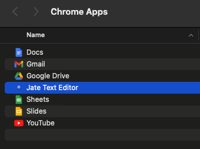
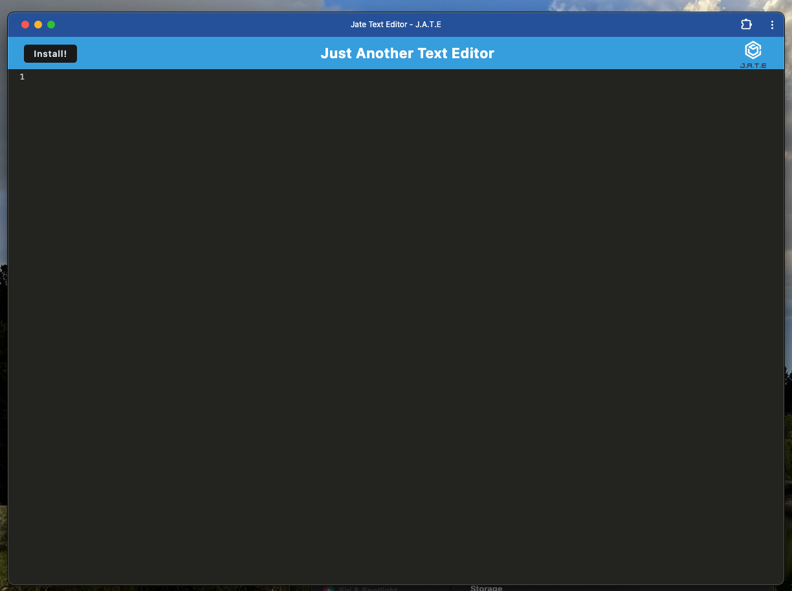

# Text Editor PWA

## Description

This is a text editor that is built as a progressive web application. The application can function in the browser as well as offline if the app has been installed. Notes/text content can be added to the text editor and accessed at a later time with or without an internet connection. 

Link to live application:

## Installation

The code for this project can be cloned from my github repo here: https://github.com/whitbreezy/text-editor-pwa

If you would like to use the application without cloning the code, you can visit the live application at this URL: 
and click the install button to install the application on your machine and access it by clicking on the app's icon and opening it on your desktop.

## Usage

This application can be used in a browser, or on the desktop if the user clicks the Install button in the browser app. Below are screenshots of the application running on the desktop and in the Chrome Apps folder of my machine. 

## Credits

I got starter code from this repo provided by my bootcamp course: https://github.com/coding-boot-camp/cautious-meme

I also referenced code from module 19, activities 26 and 28 from my coding bootcamp class notes. 
